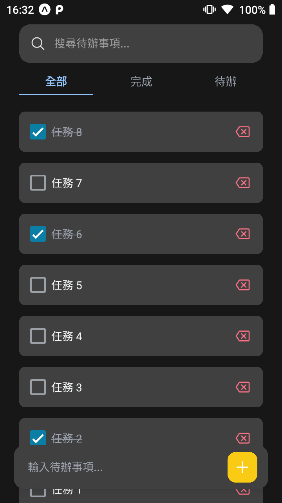
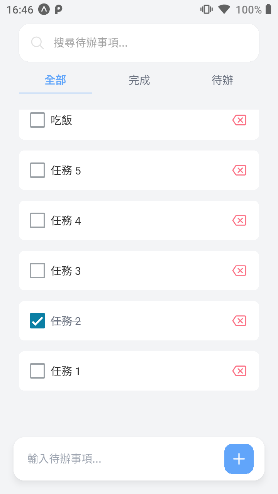

# 📝 ToDoList App


一個使用 **React Native** 製作的簡易待辦事項應用程式。建立與刪除任務，幫助使用者有效率地管理行程。

## ⚙ 技術棧

- React Native
- Expo
- TypeScript
- AsyncStorage
- Tailwind CSS

## 📱 功能介紹

- ➕ 新增待辦事項
- ✔ 勾選方式，確認完成事項
- ❌ 刪除任務
- ☑️ 完成 / 未完成分類切換
- 💾 任務本地儲存，不會隨著重啟消失
- 🎨 根據手機主題切換亮/暗模式

## 📸 截圖





## 🚀 開始使用

### 1️⃣ 安裝依賴項

```bash
npm install
# 或使用 yarn
yarn install
```
